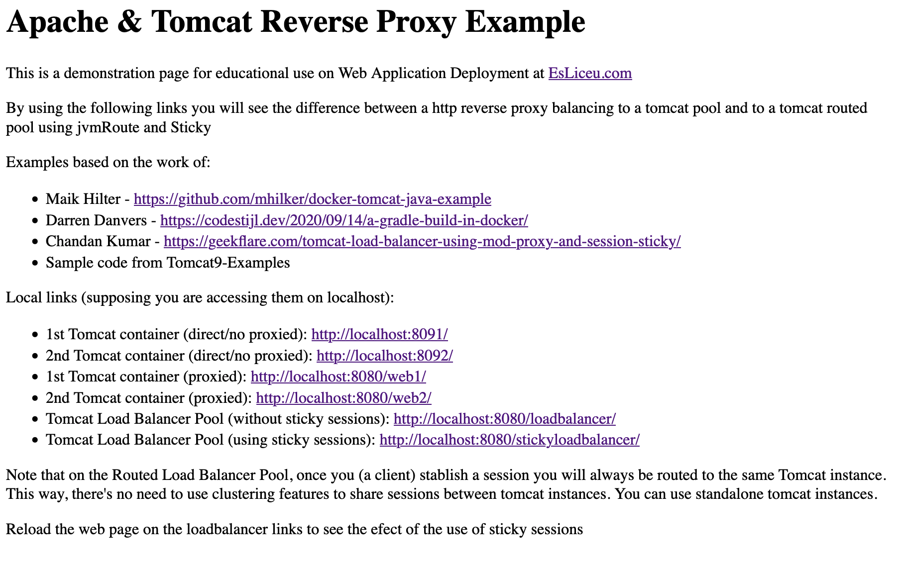

# Docker Tomcat Java Example & Sticky Session on Apache2 Balancer

[![Software License][ico-license]](LICENSE.md)

This is an example for running a stack of two docker container's with tomcat (with two java servlets examples) and an Apache2 reverse http proxy as a Load Balancer to show the use of Tomcat's Sticky Session features.

This is a modified version by Manuel Martínez from Maik Hilker's one [maik-hilkers-project].

This example adds:

  - Build servlets on a gradle docker container (local gradle install not needed)
  - Use of multistage docker builds to first build servlets and then a small customized Tomcat image with our servlets deployed on it.
  - Two example servlets from Tomcat9-Examples: HelloWorld and Session
  - Shows the use of Sticky Sessions with Apache Reverse Proxy http balancer

## Get it up and running

- [Install docker on your machine.][install-docker]

- [Install docker-compose on your machine.][install-docker-compose]

- Clone this repository.

``` bash
$ git clone https://github.com/mmartinezv2/docker-tomcat-java-example
```

- Switch to the cloned directory.

``` bash
$ cd docker-tomcat-java-example
```

- Start the stack.

``` bash
$ docker-compose up
```

- You should see an output like this.

``` bash
docker-compose up --build
Building tomcat
...
```

- Visit `localhost:8080` in your browser. You should see an output like this.



## License

The MIT License (MIT). Please see [License File](LICENSE.md) for more information.

[ico-license]: https://img.shields.io/badge/license-MIT-brightgreen.svg?style=flat-square
[install-docker]: https://docs.docker.com/engine/installation
[install-docker-compose]: https://docs.docker.com/compose/install
[install-gradle]: https://gradle.org/install
[maik-hilkers-project]: https://github.com/mhilker/docker-tomcat-java-example
